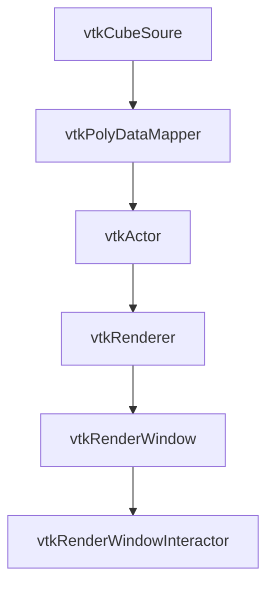

# lvim环境配置

在~/.clangd配置文件添加qt头文件路径

```shell
CompileFlags:
  Add:
    # c++11标准库
    - "-I/usr/include/c++/11/"
    # qt相关头文件路径
    - "-I/usr/include/x86_64-linux-gnu/qt5/"
    - "-I/usr/include/x86_64-linux-gnu/qt5/QtConcurrent"
    - "-I/usr/include/x86_64-linux-gnu/qt5/QtGui"
    - "-I/usr/include/x86_64-linux-gnu/qt5/QtOpenGLExtensions"
    - "-I/usr/include/x86_64-linux-gnu/qt5/QtSql"
    - "-I/usr/include/x86_64-linux-gnu/qt5/QtXml"
    - "-I/usr/include/x86_64-linux-gnu/qt5/QtCore"
    - "-I/usr/include/x86_64-linux-gnu/qt5/QtNetwork"
    - "-I/usr/include/x86_64-linux-gnu/qt5/QtPlatformHeaders"
    - "-I/usr/include/x86_64-linux-gnu/qt5/QtTest"
    - "-I/usr/include/x86_64-linux-gnu/qt5/QtDBus"
    - "-I/usr/include/x86_64-linux-gnu/qt5/QtOpenGL"
    - "-I/usr/include/x86_64-linux-gnu/qt5/QtPrintSupport"
    - "-I/usr/include/x86_64-linux-gnu/qt5/QtWidgets"
```

xmake 构建项目
```shell
xmake create -t qt.quickapp test
xmake create -t qt.widgetapp test
```

编写lua脚本编译ui文件

```lua
-- 定义一个phony类型的target来编译.ui文件
target("ui")
    set_kind("phony")
    -- 使用add_files添加需要编译的ui文件即可
    add_files("src/mainwindow.ui")
    on_load(function (target)
        for _, file in ipairs(target:sourcefiles()) do
            local idx = file:reverse():find("/", 1, true)
            local path, name
            if idx then
                path = file:sub(1, #file - idx + 1)
                name = file:sub(#file - idx + 2, #file - 3)
            else
                path = ""
                name = file
            end
            h_file = path .. "ui_" .. name .. ".h"
            os.vrun("uic -o " .. h_file .. " " .. file)
        end
    end)
```

# 信号和槽

```c++
QObject::connect(sender, SINGNAL(singnal()), receiver, SLOT(slot()));
```

```c++
// 工具栏，菜单栏，状态栏
QToolbar* toolbar = new QToolbar();
QMenubar* menubar = new QMenubar();
QStatusbar* statusbar = new QStatusbar();
```

# QLabel

```c++
// 标签
QLabel* label;
label = new QLabel;

QString str = "hello world!";
label->setText(str);
// 将小容器放到大容器里
label->setParent(this);
```

```c++
QLabel* label2 = new QLabel;
// text() 获取文本
lable2->setText(lable->text());

QString qstr = label2->text();
// Qstring转换成std::string
std::string str2 = qstr.toStdString();
std::cout << str2 << std::endl;

std::String string;
QString qstring = QString::fromStdString(string);

// 中文乱码问题
std::string str = std::string((const char*) qstring.toLocal8Bit());

// 设置位置和大小，(x, y, w, h)
lable->setGeometry(0, 0, 100, 300);
```

# font

```c++
QFont font = lable->font();
font.setBold();         // 粗体
font.setItalic();       // 斜体
font.setUnderline();    // 下划线
font.setPixelSize(100); // 字体大小(不会自适应)
font.setPointSize(10);  // 字体大小(会自适应)
font.setFamily("楷体"); // 字体

lable->setFont(font);

// 设置背景颜色，字体颜色
lable->setStyleSheet("QLabel{background-color: green; color: cyan;}");
```

# Button

```c++
// PushButton, RadionButton, CheckBox, 普通，单选，复选按钮
QPushButton pus = new QPushButton();
pus->setText("确定");
pus->setGeometry(100, 100, 100, 100);
pus->setParent(this);
```

信号函数

```c++
press(), clicked(), released();
```

槽函数
```c++
close(), hide()

...
QObject::connect(pus, SINGNAL(clicked(bool)), this, SLOT(checked(bool)));
...
void Widget::checked(bool click) {
    std::cout << "clicked\n";
}
```

# QPlainTextEdit

```c++
QPlainTextEdit plai = new QPlainTextEdit(tr("hello world"));
plai->setParent(this);
plai->setPlainText("test");

plai->setPlaceholderText("input...");
std::string str = plai->placeholderText().toStdString();
std::cout << str;

plai->setReadOnly(true); // 设置只读
plai->setLineWrapMode(QPlainTextEdit::NoWrap);      // 无软换行
plai->setLineWrapMode(QPlainTextEdit::WidgetWidth); // 有软换行
```

# QLineEdit

```c++
QLineEdit le = new QLineEdit();

le->setEchoMode(QLineEdit::NoEcho); // 无显输入
le->setEchoMode(QLineEdit::Normal); // 正常
le->setEchoMode(QLineEdit::Password); // 显示*
le->setParnet(this);
```

# QTextEdit

类似QPlainTextEdit

# QBoxLayout

```c++
// 水平约束
QHBoxLayout* hbx1 = new QHBoxLayout(this);

// 添加容器
hbx1->addWidget(che);
hbx1->addWidget(rad);
hbx1->addWidget(pus);

// 添加层
hbx1->addLayout(hbx2);

// 添加弹簧
hbx1->addStretch(1);

// 设置空白
hbx1->setSpacing(1000);
hbx1->addSpacing(-950);
setLayout(hbx1);


// 垂直方向
QVBoxLayout hbx2;
```

# QProgressbar 进度条

```c++
QProgressBar* pro = new QProgressBar();
pro->setMinimumWidth(150);
pro->setMinimumHeight(50);
pro->setMaximumWidth(500);
pro->setMaxinumWidth(500);
pro->setMinimum(0);
pro->setMaximum(100);
pro->setValue(10);

// 水平方向
pro->setOrientation(Qt::Vertical);
// 垂直方向
pro->setOrientation(Qt::Horizontal);
```

# Spinbox 显示数字控件

```c++
QSpinBox spn = new QSpinBox();
spn->setMaximum(50);
spn->setMinimum(0);
spn->setMinimumWidth(60);
spn->setMinimumHeight(30);
spn->setGeometry(100, 100, 100, 30);
spn->setSingleStep(3);  // 设置步长
spn->setDisplayIntegeraBase(8); // 设置进制显示,2,8,10,16
spn->setPrefix("<");    // 设置前缀
spn->setSuffix(">");    // 设置后缀


// 常用信号函数
// 数值变化时发出信号，参数为当前显示的数值
valueChange(int size);

connect(spn, SINGNAL(valueChange(int)), this, SLOT(func(int)));

void Widget::func(int size) {
    std::cout << size << std::endl;
}
```


# QGraphicsView

```c++
QGraphicsView* view = new QGraphicsView(0, 0, 300, 400);
QGraphicsScene* scene = new QGraphicsScene(0, 0, 300, 400);
view->setScene(scene);

scene->addItem(item);

```

# QTableWidget

```c++
setRowCount(int rows);
setText(const QString& text);

// 信号
cellClicked(int row, int column);
cellEntered(int row, int column);
itemClicked(QTableWidgetItem *item);
```

# QT + VTK



```c++
vtkNew<vtkGenericOpenGLRenderWindow> renderWindow;
vtkNew<vtkRenderer> renderer;   // 渲染器
vtkNew<vtkPoints> points;       // 原始数据点(仅包含坐标)
vtkNew<vtkPolyData> polydata;   // 包含其他信息的数据集
vtkNew<vtkVertexGlyphFilter> glyphFilter;   // 将点转换为可渲染的单元(将点转换成小球)
vtkNew<vtkPolyDataMapper> mapper;   
vtkNew<vtkActor> actor;
vtkNew<vtkAxesActor> axesActor; // 坐标轴
vtkNew<vtkCamera> camera;       // 相机


// 设置坐标轴长度
axesActor->SetTotalLength(10, 10, 10);


// 数据添加基本流程
points->InsertNextPoint(x, y, z);
polydata->SetPoints(points);
glyphFilter->SetInputData(polydata);
mapper->SetInputConnection(glyphFilter->GetOutputPort());
actor->SetMapper(mapper);
renderer->AddActor(actor);
renderer->AddActor(axesActor);
renderer->SetActiveCamera(camera);
renderWindow->Render();

// 添加数据
points->InsertNextPoint(x, y, z);
points->Modified();

// 相机设置位置、角度、焦点
camera->SetPosition(x, y, z);
camera->SetViewUp(0, 0, 1);
camera->SetFocalPoint(0, 0, 0);


vtkNew<vtkCellArray> cells;
vtkNew<vtkPolyDataMapper> mapper_line;
vtkNew<vtkPolyData> polydata_line;
vtkNew<vtkActor> actor_line;

// 渲染曲线(需要添加点的信息)
polydata_line->SetPoints(points);
polydata_line->SetLines(cells);
mapper_line->SetMapper(mapper_line);
actor_line->SetMapper(mapper_line);

// 设置某条线的连线关系
vtkNew<vtkLine> line;
line->GetPointIds()->SetId(0, i);
line->GetPointIds()->SetId(1, i + 1);
cells->InsertNextCell(line);

// 设置颜色
actor_line->GetProperty()->SetColor(1.0, 0.0, 0.0);

// 设置曲线
cells->InsertNextCell({i, j, k});
```

## 添加左下角同步小坐标轴
```c++
vtkNew<vtkOrientationMarkerWidget> axesWidget;
axesWidget->SetOutlineColor(0.93, 0.57, 0.13);
axesWidget->SetOrientationMarker(axesActor);
axesWidget->SetInteractor(vtkWidget->interactor());
axesWidget->SetEnabled(1);
axesWidget->SetViewport(0.0, 0.0, 0.2, 0.2);
axesWidget->EnabledOn();
axesWidget->InteractiveOn();
```

在renderWindow->AddRenderer(renderer)，渲染窗口在添加渲染器后，
才会生成或绑定交互器vktRenderWindowInteractor。

